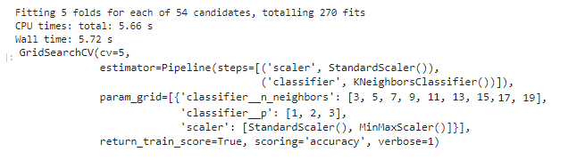
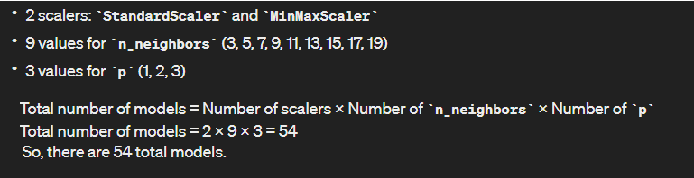
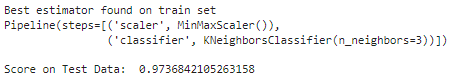
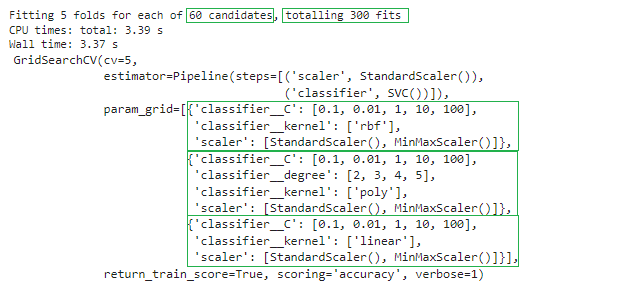
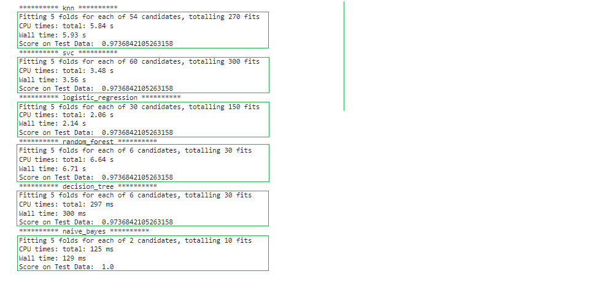
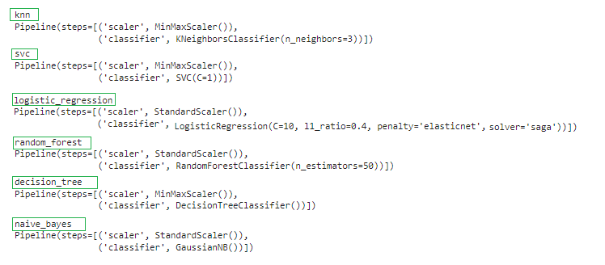
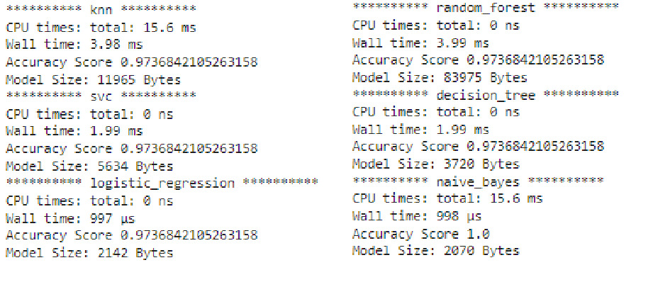

# Pipeline and Productionisation of Machine Learning Models (Model Serialization)

# Machine Learning Model Pipeline and Productionization

This repository provides a guide to building, serializing, and deploying machine learning (ML) models in real-world applications. The process involves pipeline development, model serialization, and productionization steps.

## Pipeline Development

### Data Preparation

- **Data Collection**: Gather relevant data for model training and testing.
- **Data Cleaning**: Handle missing values, outliers, and inconsistencies in the data.
- **Feature Engineering**: Create new features or transform existing ones to enhance model performance.
- **Data Splitting**: Divide the dataset into training, validation, and test sets.

### Model Training

- **Model Selection**: Choose an appropriate ML algorithm based on the problem domain, data characteristics, and performance metrics.
- **Model Training**: Train the selected model using the training dataset.
- **Model Evaluation**: Assess the model's performance using the validation dataset and fine-tune hyperparameters if necessary.

### Pipeline Construction

- **Pipeline Creation**: Construct a data processing pipeline that includes data preprocessing, feature extraction, and model training steps.
- **Pipeline Optimization**: Optimize the pipeline for efficiency and scalability.

## Model Serialization

### Serialization

- **Serialization** is the process of converting an object into a format that can be easily stored, transmitted, and reconstructed.
- In the context of ML, model serialization involves saving trained models to disk in a persistent format.

### Benefits of Serialization

- **Portability**: Serialized models can be deployed across different environments (e.g., cloud platforms, edge devices).
- **Efficiency**: Serialized models facilitate faster loading and inference times.
- **Versioning**: Serialized models can be version-controlled and managed efficiently.

### Serialization Techniques

- Common serialization formats include:
  - **Pickle**: A Python-specific serialization library that can serialize almost any Python object.
  - **Joblib**: A more efficient alternative to Pickle for serializing large NumPy arrays.
  - **JSON**: Lightweight, human-readable serialization format suitable for simple ML models.
  - **Protobuf (Protocol Buffers)**: A binary serialization format optimized for performance and compatibility across different programming languages.

## Model Productionization

### Deployment

- **Model Deployment**: Integrate the serialized model into production systems (e.g., web services, APIs, applications).
- **Scalability**: Design deployment architecture to handle varying loads and scale resources dynamically.
- **Monitoring**: Implement monitoring solutions to track model performance, data drift, and system health in real-time.

### Maintenance

- **Model Maintenance**: Continuously monitor and update deployed models to adapt to changing data distributions and business requirements.
- **Version Control**: Maintain version control for models, pipelines, and associated artifacts to facilitate reproducibility and traceability.

### Security

- **Access Control**: Implement access control mechanisms to restrict unauthorized access to sensitive data and models.
- **Data Privacy**: Ensure compliance with data privacy regulations (e.g., GDPR, HIPAA) by anonymizing or encrypting sensitive information.


## Introducing Pipelines for Optimal Workflow
- Pipelines help improve the efficiency, reproducibility, and scalability of the machine learning workflow by automating and standardizing common tasks and processes. 
- They also promote cleaner and more modular code, making it easier to maintain and extend machine learning models over time.

### How does Pipeline work?
- Pipeline allows you to sequentially apply a list of transformers to preprocess the data and, if desired, conclude the sequence with a final predictor for predictive modeling.

### Pipelines are important because

1. __Efficient Hyperparameter Tuning__: Using pipelines also allows for hyperparameter tuning and cross-validation to be performed more efficiently, as the entire pipeline can be treated as a single estimator. 
    * This makes it easier to search over a space of hyperparameters and evaluate different configurations. 
    * Overall, pipelines promote code `modularity`, `reusability`, and `reproducibility` in machine learning projects.

2. __Automate ML Workflows__: They help automate machine learning workflows by sequentially applying a series of preprocessing steps followed by a model fitting step. 
    * This ensures that all preprocessing steps are applied consistently to both the training and testing data, avoiding data leakage and making the code more readable and maintainable.

```python
from sklearn.pipeline import Pipeline
from sklearn.preprocessing import StandardScaler, MinMaxScaler
from sklearn.neighbors import KNeighborsClassifier
from sklearn.model_selection import GridSearchCV

# Define pipeline steps
pipe_1 = Pipeline(
    [
        ('scaler', StandardScaler()),
        ('classifier', KNeighborsClassifier())
    ]
)

N_NEIGHBORS = [i for i in range(3, 21, 2)]
P = [1, 2, 3]

# Observe the Key Value Pair format
parameter_grid_1 = [
    {
        'scaler': [StandardScaler(), MinMaxScaler()],
        'classifier__n_neighbors' : N_NEIGHBORS,              
        'classifier__p' : P
    }
]

clf = GridSearchCV(
        estimator=pipe_1, 
        param_grid=parameter_grid_1, 
        scoring='accuracy',
        cv=5,
        return_train_score=True,
        verbose=1
)

%time clf.fit(X_train, y_train)
```



```python
print("Best estimator found on train set")
print(clf.best_estimator_)
print('Score on Test Data: ', clf.score(X_test, y_test))
```



## Serialization and Deserialization
Serialization is the process of converting a Python object into a byte stream, which can then be stored in a file or transmitted over a network. Deserialization is the reverse process, where the byte stream is converted back into a Python object.

In the context of the joblib library in Python:

1. __Serialization__: In joblib, serialization refers to the process of converting a Python object into a byte stream using the joblib.dump() function. This byte stream can then be written to a file or transmitted over a network.
```python
import joblib
import os

best_model = clf.best_estimator_
joblib.dump(best_model, 'best_models/demo_model_knn.pkl')
```

2. __Deserialization__: Deserialization in joblib involves reading a byte stream from a file or network and converting it back into a Python object using the joblib.load() function.

```python
model = joblib.load('best_models/demo_model_knn.pkl')
```

```python
new_data = np.array([[5.1, 3.0, 1.1, 0.1]])
prediction = model.predict(new_data)
print("Prediction:", prediction)
```

## Finding the best SVM model using Effective Pipelining and Productionization of the Model

```python
from sklearn.pipeline import Pipeline
from sklearn.preprocessing import StandardScaler, MinMaxScaler
from sklearn.svm import SVC
from sklearn.model_selection import GridSearchCV
```
```python
pipe_2 = Pipeline(
    [
        ('scaler', StandardScaler()),
        ('classifier', SVC())
    ]
)

DEGREE = [2, 3, 4, 5]
C = [0.1, 0.01, 1, 10, 100]

parameter_grid_2 = [
    {
        'scaler': [StandardScaler(), MinMaxScaler()],
        'classifier__kernel' : ['rbf'], 
        'classifier__C' : C
    }, 
    {
        'scaler': [StandardScaler(), MinMaxScaler()],
        'classifier__kernel' : ['poly'], 
        'classifier__degree' : DEGREE, 
        'classifier__C' : C
    }, 
    {
        'scaler': [StandardScaler(), MinMaxScaler()],
        'classifier__kernel' : ['linear'], 
        'classifier__C' : C
    }
]

clf = GridSearchCV(
    estimator=pipe_2, 
    param_grid=parameter_grid_2, 
    scoring='accuracy',
    cv=5,
    return_train_score=True,
    verbose=1
)

%time clf.fit(X_train, y_train)
```


## Writting Even More Complicated Pipelines to Automate the Workflow
```python
from sklearn.pipeline import Pipeline
from sklearn.model_selection import GridSearchCV
from sklearn.preprocessing import StandardScaler, MinMaxScaler
from sklearn.neighbors import KNeighborsClassifier
from sklearn.svm import SVC
from sklearn.linear_model import LogisticRegression
from sklearn.ensemble import RandomForestClassifier
from sklearn.tree import DecisionTreeClassifier
from sklearn.naive_bayes import GaussianNB
```
```python
pipelines = {
    'knn' : Pipeline([
        ('scaler', StandardScaler()),
        ('classifier', KNeighborsClassifier())
    ]), 
    'svc' : Pipeline([
        ('scaler', StandardScaler()),
        ('classifier', SVC())
    ]),
    'logistic_regression': Pipeline([
        ('scaler', StandardScaler()),
        ('classifier', LogisticRegression())
    ]),
    'random_forest': Pipeline([
        ('scaler', StandardScaler()),
        ('classifier', RandomForestClassifier())
    ]),
    'decision_tree': Pipeline([
        ('scaler', StandardScaler()),
        ('classifier', DecisionTreeClassifier())
    ]),
    'naive_bayes': Pipeline([
        ('scaler', StandardScaler()),
        ('classifier', GaussianNB())
    ])
}
```
```python
# Define parameter grid for each algorithm
param_grids = {
    'knn': [
        {
            'scaler': [StandardScaler(), MinMaxScaler()],
            'classifier__n_neighbors' : [i for i in range(3, 21, 2)], 
            'classifier__p' : [1, 2, 3]
        }
    ],
    'svc': [
        {
            'scaler': [StandardScaler(), MinMaxScaler()],
            'classifier__kernel' : ['rbf'], 
            'classifier__C' : [0.1, 0.01, 1, 10, 100]
        }, 
        {
            'scaler': [StandardScaler(), MinMaxScaler()],
            'classifier__kernel' : ['poly'], 
            'classifier__degree' : [2, 3, 4, 5], 
            'classifier__C' : [0.1, 0.01, 1, 10, 100]
        }, 
        {
            'scaler': [StandardScaler(), MinMaxScaler()],
            'classifier__kernel' : ['linear'], 
            'classifier__C' : [0.1, 0.01, 1, 10, 100]
        }
    ],
    'logistic_regression': [
        {
            'scaler': [StandardScaler(), MinMaxScaler()],
            'classifier__C': [0.1, 1, 10], 
            'classifier__penalty': ['l2']
        }, 
        {
            'scaler': [StandardScaler(), MinMaxScaler()],
            'classifier__C': [0.1, 1, 10], 
            'classifier__penalty': ['l1'], 
            'classifier__solver': ['liblinear']
        }, 
        {
            'scaler': [StandardScaler(), MinMaxScaler()],
            'classifier__C': [0.1, 1, 10], 
            'classifier__penalty': ['elasticnet'], 
            'classifier__l1_ratio': [0.4, 0.5, 0.6],
            'classifier__solver': ['saga']
        }
    ],
    'random_forest': [
        {
            'scaler': [StandardScaler(), MinMaxScaler()],
            'classifier__n_estimators': [50, 100, 200]
        }
    ],
    'decision_tree': [
        {
            'scaler': [StandardScaler(), MinMaxScaler()],
            'classifier__max_depth': [None, 5, 10]
        }
    ],
    'naive_bayes': [
        {
            'scaler': [StandardScaler(), MinMaxScaler()]
        }
    ]
}
```
```python
# Perform GridSearchCV for each algorithm
best_models = {}

for algo in pipelines.keys():
    print("*"*10, algo, "*"*10)
    grid_search = GridSearchCV(estimator=pipelines[algo], 
                               param_grid=param_grids[algo], 
                               cv=5, 
                               scoring='accuracy', 
                               return_train_score=True,
                               verbose=1
                              )
    
    %time grid_search.fit(X_train, y_train)
    
    best_models[algo] = grid_search.best_estimator_
    
    print('Score on Test Data: ', grid_search.score(X_test, y_test))
```


```python
for name, model in best_models.items():
    print(f"{name}")
    print(f"{model}")
    print()
```


```python
import joblib
import os

for name, model in best_models.items():
    print("*"*10, name, "*"*10)
    
    joblib.dump(model, f'best_models/{name}.pkl')
    model = joblib.load(f'best_models/{name}.pkl')
    
    # new_data = np.array([[5.1, 3.0, 1.1, 0.1]])
    %time y_test_pred = model.predict(X_test)
    print("Accuracy Score", metrics.accuracy_score(y_test, y_test_pred))
    
    print("Model Size:", os.path.getsize(f'best_models/{name}.pkl'), "Bytes")
```
