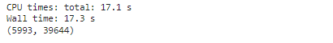
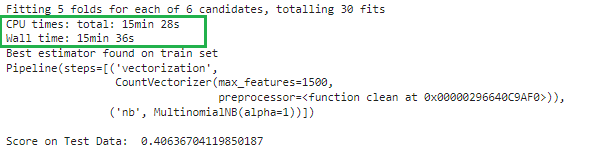
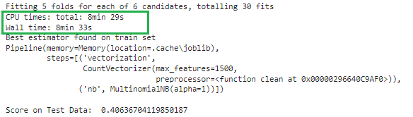
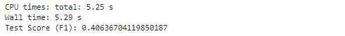
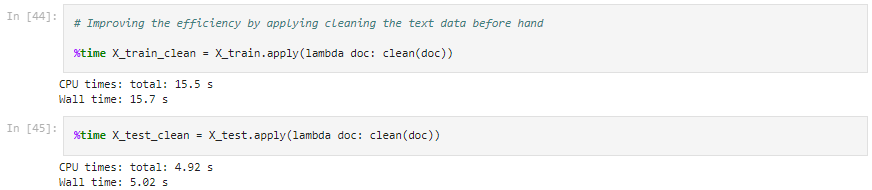
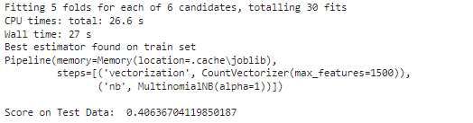
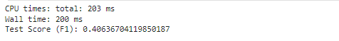
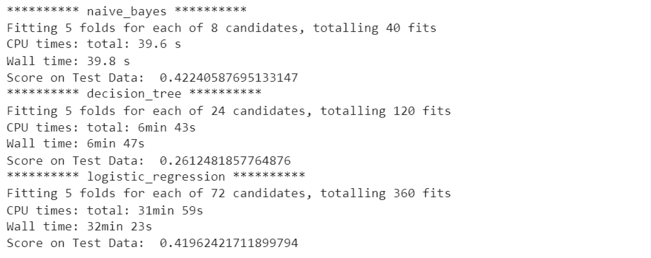
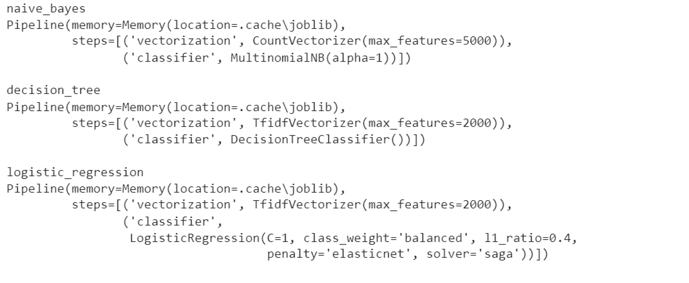
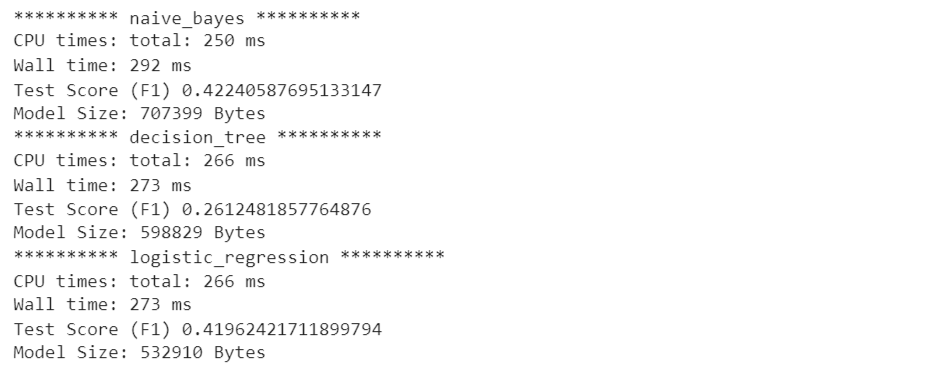

# Pipeline and Productionisation of Machine Learning Models (Model Serialization)

# Machine Learning Model Pipeline and Productionization

This repository provides a guide to building, serializing, and deploying machine learning (ML) models in real-world applications. The process involves pipeline development, model serialization, and productionization steps.

## Pipeline Development

### Data Preparation

- **Data Collection**: Gather relevant data for model training and testing.
- **Data Cleaning**: Handle missing values, outliers, and inconsistencies in the data.
- **Feature Engineering**: Create new features or transform existing ones to enhance model performance.
- **Data Splitting**: Divide the dataset into training, validation, and test sets.

### Model Training

- **Model Selection**: Choose an appropriate ML algorithm based on the problem domain, data characteristics, and performance metrics.
- **Model Training**: Train the selected model using the training dataset.
- **Model Evaluation**: Assess the model's performance using the validation dataset and fine-tune hyperparameters if necessary.

### Pipeline Construction

- **Pipeline Creation**: Construct a data processing pipeline that includes data preprocessing, feature extraction, and model training steps.
- **Pipeline Optimization**: Optimize the pipeline for efficiency and scalability.

## Model Serialization

### Serialization

- **Serialization** is the process of converting an object into a format that can be easily stored, transmitted, and reconstructed.
- In the context of ML, model serialization involves saving trained models to disk in a persistent format.

### Benefits of Serialization

- **Portability**: Serialized models can be deployed across different environments (e.g., cloud platforms, edge devices).
- **Efficiency**: Serialized models facilitate faster loading and inference times.
- **Versioning**: Serialized models can be version-controlled and managed efficiently.

### Serialization Techniques

- Common serialization formats include:
  - **Pickle**: A Python-specific serialization library that can serialize almost any Python object.
  - **Joblib**: A more efficient alternative to Pickle for serializing large NumPy arrays.
  - **JSON**: Lightweight, human-readable serialization format suitable for simple ML models.
  - **Protobuf (Protocol Buffers)**: A binary serialization format optimized for performance and compatibility across different programming languages.

## Model Productionization

### Deployment

- **Model Deployment**: Integrate the serialized model into production systems (e.g., web services, APIs, applications).
- **Scalability**: Design deployment architecture to handle varying loads and scale resources dynamically.
- **Monitoring**: Implement monitoring solutions to track model performance, data drift, and system health in real-time.

### Maintenance

- **Model Maintenance**: Continuously monitor and update deployed models to adapt to changing data distributions and business requirements.
- **Version Control**: Maintain version control for models, pipelines, and associated artifacts to facilitate reproducibility and traceability.

### Security

- **Access Control**: Implement access control mechanisms to restrict unauthorized access to sensitive data and models.
- **Data Privacy**: Ensure compliance with data privacy regulations (e.g., GDPR, HIPAA) by anonymizing or encrypting sensitive information.


## Introducing Pipelines for Optimal Workflow
- Pipelines help improve the efficiency, reproducibility, and scalability of the machine learning workflow by automating and standardizing common tasks and processes. 
- They also promote cleaner and more modular code, making it easier to maintain and extend machine learning models over time.

### How does Pipeline work?
- Pipeline allows you to sequentially apply a list of transformers to preprocess the data and, if desired, conclude the sequence with a final predictor for predictive modeling.

### Pipelines are important because

1. __Efficient Hyperparameter Tuning__: Using pipelines also allows for hyperparameter tuning and cross-validation to be performed more efficiently, as the entire pipeline can be treated as a single estimator. 
    * This makes it easier to search over a space of hyperparameters and evaluate different configurations. 
    * Overall, pipelines promote code `modularity`, `reusability`, and `reproducibility` in machine learning projects.

2. __Automate ML Workflows__: They help automate machine learning workflows by sequentially applying a series of preprocessing steps followed by a model fitting step. 
    * This ensures that all preprocessing steps are applied consistently to both the training and testing data, avoiding data leakage and making the code more readable and maintainable.

```python
from sklearn.pipeline import Pipeline
from sklearn.preprocessing import StandardScaler, MinMaxScaler
from sklearn.neighbors import KNeighborsClassifier
from sklearn.model_selection import GridSearchCV

# Define pipeline steps
pipe_1 = Pipeline(
    [
        ('scaler', StandardScaler()),
        ('classifier', KNeighborsClassifier())
    ]
)

N_NEIGHBORS = [i for i in range(3, 21, 2)]
P = [1, 2, 3]

# Observe the Key Value Pair format
parameter_grid_1 = [
    {
        'scaler': [StandardScaler(), MinMaxScaler()],
        'classifier__n_neighbors' : N_NEIGHBORS,              
        'classifier__p' : P
    }
]

clf = GridSearchCV(
        estimator=pipe_1, 
        param_grid=parameter_grid_1, 
        scoring='accuracy',
        cv=5,
        return_train_score=True,
        verbose=1
)

%time clf.fit(X_train, y_train)
```


```python
print("Best estimator found on train set")
print(clf.best_estimator_)
print('Score on Test Data: ', clf.score(X_test, y_test))
```


## Serialization and Deserialization
Serialization is the process of converting a Python object into a byte stream, which can then be stored in a file or transmitted over a network. Deserialization is the reverse process, where the byte stream is converted back into a Python object.

In the context of the joblib library in Python:

1. __Serialization__: In joblib, serialization refers to the process of converting a Python object into a byte stream using the joblib.dump() function. This byte stream can then be written to a file or transmitted over a network.
```python
import joblib
import os

best_model = clf.best_estimator_
joblib.dump(best_model, 'best_models/demo_model_knn.pkl')
```

2. __Deserialization__: Deserialization in joblib involves reading a byte stream from a file or network and converting it back into a Python object using the joblib.load() function.

```python
model = joblib.load('best_models/demo_model_knn.pkl')
```

```python
new_data = np.array([[5.1, 3.0, 1.1, 0.1]])
prediction = model.predict(new_data)
print("Prediction:", prediction)
```

## Finding the best SVM model using Effective Pipelining and Productionization of the Model

```python
from sklearn.pipeline import Pipeline
from sklearn.preprocessing import StandardScaler, MinMaxScaler
from sklearn.svm import SVC
from sklearn.model_selection import GridSearchCV
```
```python
pipe_2 = Pipeline(
    [
        ('scaler', StandardScaler()),
        ('classifier', SVC())
    ]
)

DEGREE = [2, 3, 4, 5]
C = [0.1, 0.01, 1, 10, 100]

parameter_grid_2 = [
    {
        'scaler': [StandardScaler(), MinMaxScaler()],
        'classifier__kernel' : ['rbf'], 
        'classifier__C' : C
    }, 
    {
        'scaler': [StandardScaler(), MinMaxScaler()],
        'classifier__kernel' : ['poly'], 
        'classifier__degree' : DEGREE, 
        'classifier__C' : C
    }, 
    {
        'scaler': [StandardScaler(), MinMaxScaler()],
        'classifier__kernel' : ['linear'], 
        'classifier__C' : C
    }
]

clf = GridSearchCV(
    estimator=pipe_2, 
    param_grid=parameter_grid_2, 
    scoring='accuracy',
    cv=5,
    return_train_score=True,
    verbose=1
)

%time clf.fit(X_train, y_train)
```


## Writting Even More Complicated Pipelines to Automate the Workflow
```python
from sklearn.pipeline import Pipeline
from sklearn.model_selection import GridSearchCV
from sklearn.preprocessing import StandardScaler, MinMaxScaler
from sklearn.neighbors import KNeighborsClassifier
from sklearn.svm import SVC
from sklearn.linear_model import LogisticRegression
from sklearn.ensemble import RandomForestClassifier
from sklearn.tree import DecisionTreeClassifier
from sklearn.naive_bayes import GaussianNB
```
```python
pipelines = {
    'knn' : Pipeline([
        ('scaler', StandardScaler()),
        ('classifier', KNeighborsClassifier())
    ]), 
    'svc' : Pipeline([
        ('scaler', StandardScaler()),
        ('classifier', SVC())
    ]),
    'logistic_regression': Pipeline([
        ('scaler', StandardScaler()),
        ('classifier', LogisticRegression())
    ]),
    'random_forest': Pipeline([
        ('scaler', StandardScaler()),
        ('classifier', RandomForestClassifier())
    ]),
    'decision_tree': Pipeline([
        ('scaler', StandardScaler()),
        ('classifier', DecisionTreeClassifier())
    ]),
    'naive_bayes': Pipeline([
        ('scaler', StandardScaler()),
        ('classifier', GaussianNB())
    ])
}
```
```python
# Define parameter grid for each algorithm
param_grids = {
    'knn': [
        {
            'scaler': [StandardScaler(), MinMaxScaler()],
            'classifier__n_neighbors' : [i for i in range(3, 21, 2)], 
            'classifier__p' : [1, 2, 3]
        }
    ],
    'svc': [
        {
            'scaler': [StandardScaler(), MinMaxScaler()],
            'classifier__kernel' : ['rbf'], 
            'classifier__C' : [0.1, 0.01, 1, 10, 100]
        }, 
        {
            'scaler': [StandardScaler(), MinMaxScaler()],
            'classifier__kernel' : ['poly'], 
            'classifier__degree' : [2, 3, 4, 5], 
            'classifier__C' : [0.1, 0.01, 1, 10, 100]
        }, 
        {
            'scaler': [StandardScaler(), MinMaxScaler()],
            'classifier__kernel' : ['linear'], 
            'classifier__C' : [0.1, 0.01, 1, 10, 100]
        }
    ],
    'logistic_regression': [
        {
            'scaler': [StandardScaler(), MinMaxScaler()],
            'classifier__C': [0.1, 1, 10], 
            'classifier__penalty': ['l2']
        }, 
        {
            'scaler': [StandardScaler(), MinMaxScaler()],
            'classifier__C': [0.1, 1, 10], 
            'classifier__penalty': ['l1'], 
            'classifier__solver': ['liblinear']
        }, 
        {
            'scaler': [StandardScaler(), MinMaxScaler()],
            'classifier__C': [0.1, 1, 10], 
            'classifier__penalty': ['elasticnet'], 
            'classifier__l1_ratio': [0.4, 0.5, 0.6],
            'classifier__solver': ['saga']
        }
    ],
    'random_forest': [
        {
            'scaler': [StandardScaler(), MinMaxScaler()],
            'classifier__n_estimators': [50, 100, 200]
        }
    ],
    'decision_tree': [
        {
            'scaler': [StandardScaler(), MinMaxScaler()],
            'classifier__max_depth': [None, 5, 10]
        }
    ],
    'naive_bayes': [
        {
            'scaler': [StandardScaler(), MinMaxScaler()]
        }
    ]
}
```
```python
# Perform GridSearchCV for each algorithm
best_models = {}

for algo in pipelines.keys():
    print("*"*10, algo, "*"*10)
    grid_search = GridSearchCV(estimator=pipelines[algo], 
                               param_grid=param_grids[algo], 
                               cv=5, 
                               scoring='accuracy', 
                               return_train_score=True,
                               verbose=1
                              )
    
    %time grid_search.fit(X_train, y_train)
    
    best_models[algo] = grid_search.best_estimator_
    
    print('Score on Test Data: ', grid_search.score(X_test, y_test))
```


```python
for name, model in best_models.items():
    print(f"{name}")
    print(f"{model}")
    print()
```


```python
import joblib
import os

for name, model in best_models.items():
    print("*"*10, name, "*"*10)
    
    joblib.dump(model, f'best_models/{name}.pkl')
    model = joblib.load(f'best_models/{name}.pkl')
    
    # new_data = np.array([[5.1, 3.0, 1.1, 0.1]])
    %time y_test_pred = model.predict(X_test)
    print("Accuracy Score", metrics.accuracy_score(y_test, y_test_pred))
    
    print("Model Size:", os.path.getsize(f'best_models/{name}.pkl'), "Bytes")
```

## Directly pass the preprocess step to countvectorizer
```python
def clean(doc): # doc is a string of text
    # This text contains a lot of <br/> tags.
    doc = doc.replace("</br>", " ")
    
    # Remove punctuation and numbers.
    doc = "".join([char for char in doc if char not in string.punctuation and not char.isdigit()])

    # Converting to lower case
    doc = doc.lower()
    
    # Tokenization
    tokens = nltk.word_tokenize(doc)

    # Lemmatize
    lemmatized_tokens = [lemmatizer.lemmatize(token) for token in tokens]

    # Stop word removal
    stop_words = set(stopwords.words('english'))
    filtered_tokens = [word for word in lemmatized_tokens if word.lower() not in stop_words]
    
    # Join and return
    return " ".join(filtered_tokens)
```

```python
# import feature extraction methods from sklearn
from sklearn.feature_extraction.text import CountVectorizer

# instantiate a vectorizer
vect = CountVectorizer(preprocessor=clean)

# use it to extract features from training data
%time X_train_dtm = vect.fit_transform(X_train)

print(X_train_dtm.shape)
```


# Creating an Optimal Workflow for document classification
```python
from sklearn.pipeline import Pipeline
from sklearn.feature_extraction.text import CountVectorizer, TfidfVectorizer
from sklearn.naive_bayes import MultinomialNB
from sklearn.linear_model import LogisticRegression
from sklearn.tree import DecisionTreeClassifier
from sklearn.model_selection import GridSearchCV
```
```python
pipe = Pipeline(
    [
        ('vectorization', CountVectorizer()),
        ('nb', MultinomialNB())
    ]
)

MAX_FEATURES = [1000, 1500, 2000]
ALPHA = [1, 10]

# Observe the Key Value Pair format
parameter_grid = [{'vectorization__preprocessor' : [clean],
                   'vectorization__max_features' : MAX_FEATURES, 
                   'nb__alpha' : ALPHA}]

clf = GridSearchCV(
    estimator=pipe, 
    param_grid=parameter_grid, 
    scoring='f1',
    cv=5,
    return_train_score=True,
    verbose=1
)

%time clf.fit(X_train, y_train)

print("Best estimator found on train set")
print(clf.best_estimator_)
print()

print('Score on Test Data: ', clf.score(X_test, y_test))
```


# `Implementing Caching` to optimize the runtime
* Caching is a technique used in software engineering to improve performance by storing frequently accessed or computed data in a temporary storage location, known as a cache. The purpose of caching is to reduce the time and resources required to access or compute the same data repeatedly.

* We can create the __Memory__ object to cache the intermediate results of vectorization.

* This will avoid redundant computations of vectorization during the grid search, thereby optimizing the runtime. Adjust the cachedir parameter as needed to specify the location for caching the results.

```python
import joblib
from joblib import Memory
import os
```

```python
# Define a memory object to cache intermediate results
cachedir = '.cache'
memory = Memory(location=cachedir, verbose=0)

# Define the pipeline with caching
pipe = Pipeline(
    [
        ('vectorization', CountVectorizer()),
        ('nb', MultinomialNB())
    ], 
    memory=memory
)

MAX_FEATURES = [1000, 1500, 2000]
ALPHA = [1, 10]

# Observe the Key Value Pair format
parameter_grid = [
    {
        'vectorization__preprocessor': [clean],
        'vectorization__max_features': MAX_FEATURES,
        'nb__alpha': ALPHA
    }
]

clf = GridSearchCV(
    estimator=pipe,
    param_grid=parameter_grid,
    scoring='f1',
    cv=5,
    return_train_score=True,
    verbose=1
)

%time clf.fit(X_train, y_train)
```

```python
print("Best estimator found on train set")
print(clf.best_estimator_)
print('Score on Test Data: ', clf.score(X_test, y_test))
```


#### Serialization
```python
best_model = clf.best_estimator_
joblib.dump(best_model, 'best_models/demo_model_nb.pkl')
```

#### Deserialization
```python
model = joblib.load('best_models/demo_model_nb.pkl')
new_data = [
    """Inflation in the 20-nation euro zone eased to 2.6% in February, 
    flash figures showed on Friday, but both the headline and core 
    figures were higher than expected.
    Economists polled by Reuters had forecast a headline reading of 2.5%.
    Core inflation, stripping out volatile components of energy, food, 
    alcohol and tobacco, was 3.1% — above the 2.9% expected.
    The European Union statistics agency said food, alcohol and tobacco 
    had the highest inflation rate in February at 4%, followed by services 
    at 3.9%.
    Energy prices, which had swollen last year as a result of Russia’s 
    invasion of Ukraine, continued to reduce, with the rate of deflation 
    moving from -6.1% to -3.7%.
    The headline print previously came in at 2.8% in January, with further 
    easing expected after price rises cooled in Germany, France and Spain.
    Investors are hunting for clues on when the European Central Bank will 
    start to bring down interest rates, with market pricing pointing to a 
    June cut. Yet many ECB officials still stress that they need spring wage 
    negotiations to conclude before they have a clearer picture of domestic 
    inflationary pressures.
    The February figures will be a mixed bag for policymakers, as core 
    inflation is holding above 3% even as the headline rate moves toward 
    the ECB’s 2% target. Price rises have nonethless cooled significantly 
    from their peak of 10.6% in October 2022.""", 

    """While many of the responses online appeared lighthearted, the posts 
    show just how quickly and easily misinformation can spread on social 
    media. The response also underscores an uptick in interest in extraterrestrial 
    activity, from hearings in Congress last summer about “unidentified aerial 
    phenomena” or “UAPs” to Mexico’s Congress showing off what it claimed were 
    “nonhuman” aliens. Both of those events also became prime meme fodder.
    However, Vega said aliens had nothing to do with Monday’s incident.
    “There were no aliens,” he wrote in the email. “No airports were closed. 
    Nothing is being withheld from the public. LOL.”
    Still, by Friday afternoon, “Miami Mall Alien” was trending on the social 
    media site X.
    “10ft Aliens/Creatures (caught on camera?) fired at inside and outside Miami 
    Mall, media silent, cops are covering it up saying kids were fighting with 
    fireworks, yet all these cop cars, & air traffic stopped that night except for 
    black military choppers…and no media coverage,” claimed one post on X, which on 
    Friday appeared to trigger a slew of conspiracy theories and memes.
    One person posted what appeared to be an AI image of a generic alien holding 
    shopping bags, and joked it was “The Miami Mall Alien.” """
]

prediction = model.predict(new_data)
print("Prediction:", prediction)
```


### Check the CPU time for prediction(__preprocess included__)
```python
# Let's analyse the models prediction time and model size

%time y_test_pred = model.predict(X_test)

print("Test Score (F1):", metrics.f1_score(y_test, y_test_pred))
```


```python
print("Model Size:", os.path.getsize('best_models/demo_model_nb.pkl'), "Bytes")
```


# `Implementing Memoization` to further improve the runtime
As a software engineer, besides `caching`, you can employ several techniques to improve the time complexity of your code. `Implement memoization to store the results of expensive function calls` and reuse them when the same inputs occur again. This is particularly useful for dynamic programming problems.


```python
# Define a memory object to cache intermediate results
cachedir = '.cache'
memory = Memory(location=cachedir, verbose=0)

# Define the pipeline with caching
pipe = Pipeline(
    [
        ('vectorization', CountVectorizer()),
        ('nb', MultinomialNB())
    ], 
    memory=memory
)

MAX_FEATURES = [1000, 1500, 2000]
ALPHA = [1, 10]

# Observe the Key Value Pair format
parameter_grid = [
    {
        'vectorization__max_features': MAX_FEATURES,
        'nb__alpha': ALPHA
    }
]

clf = GridSearchCV(
    estimator=pipe,
    param_grid=parameter_grid,
    scoring='f1',
    cv=5,
    return_train_score=True,
    verbose=1
)
```
```python
%time clf.fit(X_train_clean, y_train)

print("Best estimator found on train set")
print(clf.best_estimator_)
print()

print('Score on Test Data: ', clf.score(X_test_clean, y_test))
```


### Check the CPU time for prediction(preprocess not included), improve

```python
# Let's analyse the models prediction time and model size

%time y_test_pred = model.predict(X_test_clean)

print("Test Score (F1):", metrics.f1_score(y_test, y_test_pred))
```


## Putting it all together: Implementing various Algorithms to find the Best Model

```python
# Define a memory object to cache intermediate results
cachedir = '.cache'
memory = Memory(location=cachedir, verbose=0)

pipelines = {
    'naive_bayes': Pipeline([
        ('vectorization', CountVectorizer()),
        ('classifier', MultinomialNB())
    ], memory=memory),
    'decision_tree': Pipeline([
        ('vectorization', CountVectorizer()),
        ('classifier', DecisionTreeClassifier())
    ], memory=memory),
    'logistic_regression': Pipeline([
        ('vectorization', CountVectorizer()),
        ('classifier', LogisticRegression())
    ], memory=memory)
}
```
```python
# Define parameter grid for each algorithm
param_grids = {
    'naive_bayes': [
        {
            'vectorization': [CountVectorizer()],
            'vectorization__max_features' : [1000, 1500, 2000, 5000], 
            'classifier__alpha' : [1, 10]
        }
    ],
    'decision_tree': [
        {
            'vectorization': [CountVectorizer(), TfidfVectorizer()],
            'vectorization__max_features' : [1000, 1500, 2000, 5000],
            'classifier__max_depth': [None, 5, 10]
        }
    ],
    'logistic_regression': [
        {
            'vectorization': [CountVectorizer(), TfidfVectorizer()],
            'vectorization__max_features' : [1000, 1500, 2000, 5000], 
            'classifier__C': [0.1, 1, 10], 
            'classifier__penalty': ['elasticnet'], 
            'classifier__l1_ratio': [0.4, 0.5, 0.6],
            'classifier__solver': ['saga'],
            'classifier__class_weight': ['balanced']
        }
    ]
}
```

```python
# Perform GridSearchCV for each algorithm
best_models = {}

for algo in pipelines.keys():
    print("*"*10, algo, "*"*10)
    grid_search = GridSearchCV(estimator=pipelines[algo], 
                               param_grid=param_grids[algo], 
                               cv=5, 
                               scoring='f1', 
                               return_train_score=True,
                               verbose=1
                              )
    
    %time grid_search.fit(X_train_clean, y_train)
    
    best_models[algo] = grid_search.best_estimator_
    
    print('Score on Test Data: ', grid_search.score(X_test_clean, y_test))
```


```python
for name, model in best_models.items():
    print(f"{name}")
    print(f"{model}")
    print()
```


```python
for name, model in best_models.items():
    print("*"*10, name, "*"*10)
    
    joblib.dump(model, f'best_models/{name}.pkl')
    model = joblib.load(f'best_models/{name}.pkl')
    
    %time y_test_pred = model.predict(X_test_clean)
    print("Test Score (F1)", metrics.f1_score(y_test, y_test_pred))
    
    print("Model Size:", os.path.getsize(f'best_models/{name}.pkl'), "Bytes")
```

